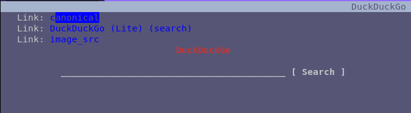

# elinks-nolinks

remove header links in elinks

before:



afer:


# install

1. you need to install [elinks-plug](http://github.com/yazgoo/elinks-plug)
1. then you need to add to your hook file the following plugins:

```lua
plug("git@github.com:yazgoo/elinks-basis")
plug("git@github.com:yazgoo/elinks-nolinks")
```

